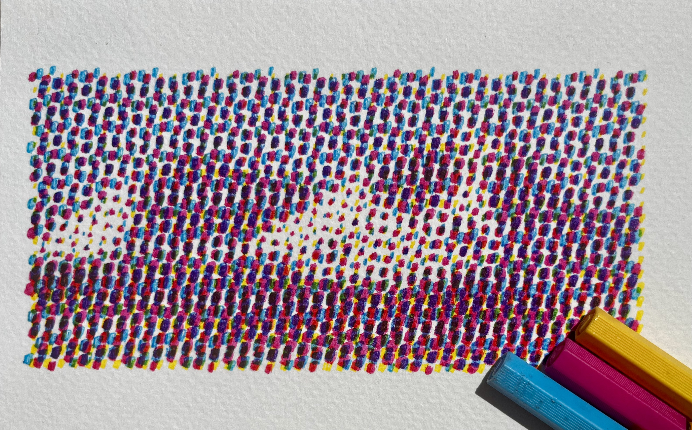

# Halftone generator
This tool generates [halftone](https://en.wikipedia.org/wiki/Halftone) from a given image ([amazing video about halftone](https://youtu.be/VckU9UXI_XE?si=nIdPdpMmwybd5goc)). 
The output is in a from of an `svg` file.
The tool was created to generate halftone images that can be printed with a pen plotter. This guided the choice of the parameters and the output format.

|  |  |  |
|-------------------------------------------|-----------------------------------------------|---------------------------------------------------|


# Installation

### Python 

I used Python `3.12`.
For installation, I recommend using miniconda ([quick command line installation guide](https://docs.anaconda.com/miniconda/#quick-command-line-install)). 

After installing miniconda, create a new environment by running:
```bash
conda create --name halftone python=3.12
```

Activate the environment by running:
```bash
conda activate halftone
```

### Requirements

After cloning or downloading the repository, install the required packages by running:
```bash
pip install -r requirements.txt
```

# Usage

Function `generate_halftone` from `src/halftone.py` splits the given image is split into four layers (C, M, Y, K).
Each layer consists of points on a grid.
The size of the points is proportional to the average color intensity of the area covered by the circle.
Grids are rotated to a given angle to mitigate the [Moiré pattern](https://en.wikipedia.org/wiki/Moir%C3%A9_pattern).


The function has the following parameters:

| Parameter      | Description                                                                         | Default                                        |
|----------------|-------------------------------------------------------------------------------------|------------------------------------------------|
| `image_path`   | path to the image                                                                   |                                                |
| `save_path`    | path to save the svg                                                                |                                                |
| `paper_w`      | width of the paper in meters                                                        |                                                |
| `paper_h`      | height of the paper in meters                                                       |                                                |
| `max_dot_size` | maximum size of the dots in meters                                                  |                                                |
| `colors`       | list of hex color codes for each layer                                              | `["#00ffff", "#ff00ff", "#ffff00", "#000000"]` |
| `angles`       | list of angles in degrees for each layer                                            | `[15, 75, 0, 45]`                              |
| `lws`          | list of line widths in millimeters for each layer                                   | `[1, 1, 1, 1]`                                 |
| `pad`          | padding in meters                                                                   | `0`                                            |
| `use_black`    | whether to plot the black layer or not                                              | `False`                                        |
| `fit_how`      | how to fit the image to the paper (options: `"fit"`, `"fit-width"`, `"fit-height"`) | `"fit"`                                        |

### Command line

After installing and activating the environment,
you can run python in the command line:

```bash
python
```
    
Then you can import the function and run it with your parameters:

```python
import src.halftone as ht
ht.generate_halftone("example/tatry.jpeg","./example", 0.141, 0.1, 0.003, lws=[0.4,0.4,0.4,0.4], alphas=[0.8, 0.8, 0.8, 0.8], pad=0.005)
```

### Jupyter notebook

Please see the [example](./example/README.md) for a detailed guide on how to use the tool in a jupyter notebook.


# Contribution

You can contribute to this project by creating a pull request or submitting an issue.

# License

This project is licensed under the MIT License (see the [LICENSE](LICENSE) file for details).